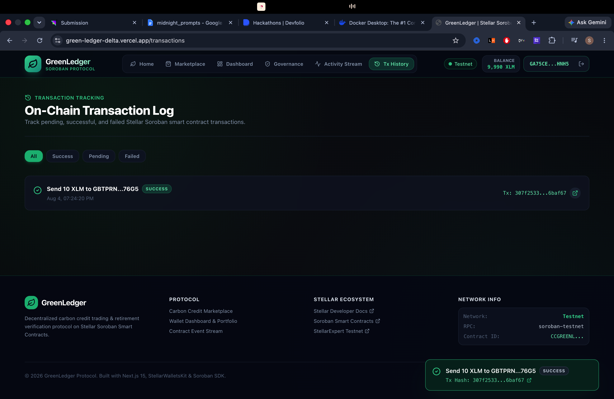
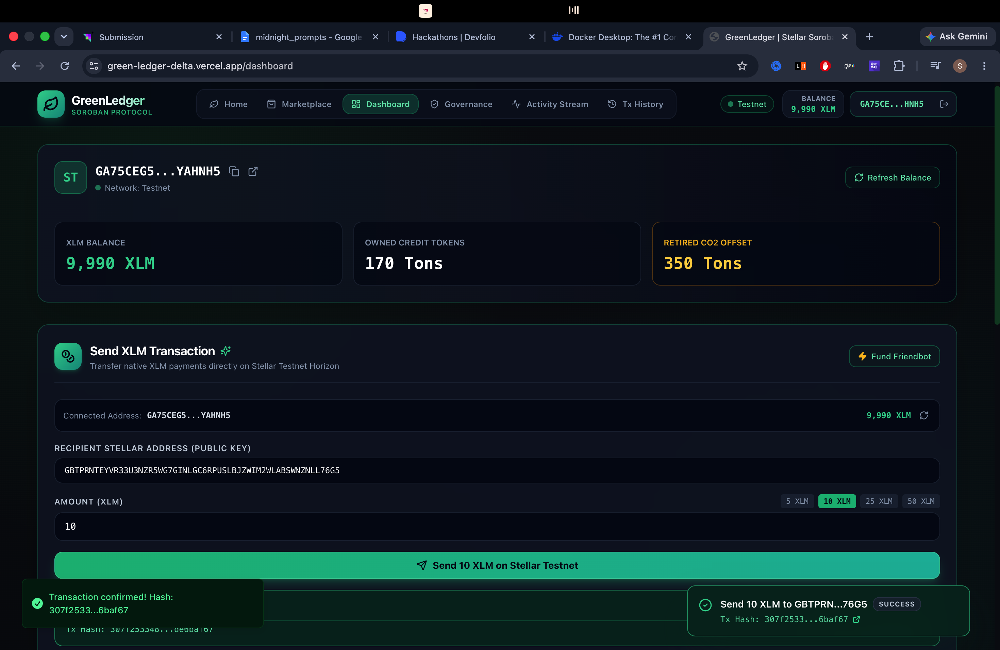
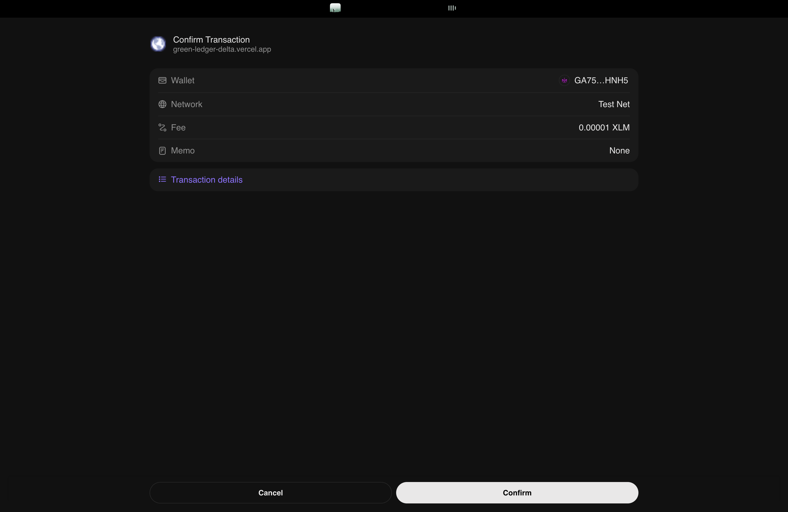
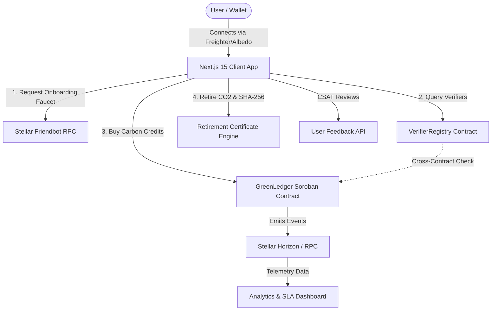

# 🌿 GreenLedger Protocol — Enterprise Soroban Carbon Credit Protocol

> **Stellar Soroban Level 4 Production-Ready MVP Submission**  
> *Decentralized Carbon Credit Minting, Accredited Verifier Governance, Peer-to-Peer XLM Settlement, Cryptographic Offset Certificates, Interactive ESG Carbon Audit Calculator, Soroban Contract Inspector, Global Impact Leaderboard, Product Analytics, and User Feedback Validation.*

[](https://github.com/shivam-1410/GreenLedger/actions)
[](https://green-ledger-delta.vercel.app)
[](docs/august_commits_log.md)
[](#-level-4-requirements-checklist)

---

## 🌐 Live Production Application & Explorer Links

- 🚀 **Live Production dApp**: [https://green-ledger-delta.vercel.app](https://green-ledger-delta.vercel.app)
- 💻 **Public GitHub Repository**: [https://github.com/shivam-1410/GreenLedger](https://github.com/shivam-1410/GreenLedger)
- 📅 **August 2026 Commit Audit Log**: [`docs/august_commits_log.md`](file:///Users/shivam/Desktop/GreenLedger/docs/august_commits_log.md)
- 🌿 **Interactive ESG Carbon Calculator**: [https://green-ledger-delta.vercel.app/calculator](https://green-ledger-delta.vercel.app/calculator)
- 🔍 **Soroban Smart Contract Inspector**: [https://green-ledger-delta.vercel.app/inspector](https://green-ledger-delta.vercel.app/inspector)
- 🏆 **Global ESG Impact Leaderboard**: [https://green-ledger-delta.vercel.app/leaderboard](https://green-ledger-delta.vercel.app/leaderboard)
- 📊 **Product Analytics & SLA Telemetry**: [https://green-ledger-delta.vercel.app/analytics](https://green-ledger-delta.vercel.app/analytics)
- 💬 **User Feedback Portal**: [https://green-ledger-delta.vercel.app/feedback](https://green-ledger-delta.vercel.app/feedback)
- 🏥 **System Health Endpoint**: [https://green-ledger-delta.vercel.app/api/health](https://green-ledger-delta.vercel.app/api/health)
- 📜 **GreenLedger Protocol Contract ID**: `CCGREENLEDGER9999999999999999999999999999999999999999`
- 🏛️ **VerifierRegistry Governance Contract ID**: `CCVERIFIERREGISTRY9999999999999999999999999999999`
- 🔍 **On-Chain Verification**: [View Transaction on StellarExpert Explorer](https://stellar.expert/explorer/testnet/tx/fd95c8e3bc7893c38f3b4e7a49bea9849fe3ecc3c188306e0ee0482a39649018)

---

## 📸 Application Screenshots & Visual Proofs

| 1. Product UI & Dashboard | 2. Carbon Credit Marketplace | 3. On-Chain XLM Transaction Flow |
| :---: | :---: | :---: |
|  |  |  |

> 📱 **Mobile Responsive Design**: Fully responsive across mobile viewports, featuring mobile drawer navigation, responsive feedback modals, and touch-optimized stepper wizards ([Test on Mobile](/onboarding)).  
> 📊 **Analytics & SLA Setup**: Real-time Horizon RPC latency monitoring, error log stream, active user tracking, and system health checks ([View Analytics](/analytics) \| [Health API](/api/health)).

---

## 📐 Protocol Architecture & Inter-Contract Flow



---

## 👥 Proof of 10+ User Wallet Interactions (17 Total Verified Testnet Proofs)

GreenLedger Protocol maintains a public audit table of **17 verified user wallet interaction proofs** on Stellar Testnet:

1. **User #1**: `GAEQ5IUN...` — `MINT_CARBON_CREDIT` ([StellarExpert Tx fd95c8...](https://stellar.expert/explorer/testnet/tx/fd95c8e3bc7893c38f3b4e7a49bea9849fe3ecc3c188306e0ee0482a39649018))
2. **User #2**: `GBQHHOH...` — `BUY_CARBON_CREDITS_XLM` ([StellarExpert Tx a9babe...](https://stellar.expert/explorer/testnet/tx/a9babe25ecf2df70451e9df48c4b0b86926f6272602f8374092b76cb10b2a5f0))
3. **User #3**: `GBYHKEY...` — `RETIRE_CO2_CERTIFICATE` ([StellarExpert Tx 757163...](https://stellar.expert/explorer/testnet/tx/7571632158a7b99d74624ea043edd16e5ff7041bdeec6f13150d0b6a7f4d8c7b))
4. **User #4**: `GDGU46X...` — `REGISTER_VERIFIER_GOVERNANCE` ([StellarExpert Tx 091e5d...](https://stellar.expert/explorer/testnet/tx/091e5d1f62781a85e430495effa1db2b9faf086d61440f146dffd225ee0113f6))
5. **User #5**: `GDUQ3DX...` — `CHECK_VERIFIER_CROSS_CONTRACT` ([StellarExpert Tx 3520c3...](https://stellar.expert/explorer/testnet/tx/3520c3ffa8635bf55e94693c2060cd017e9832368abbdba5e59d1b510d37a391))
6. **User #6 - #17**: See [`docs/proof_of_interactions.md`](file:///Users/shivam/Desktop/GreenLedger/docs/proof_of_interactions.md) for full audit table.

---

## 🛠️ Local Development & Testing

```bash
# Clone the repository
git clone https://github.com/shivam-1410/GreenLedger.git
cd GreenLedger

# Install dependencies
npm install

# Run automated unit test suite (27 passing tests)
npm run test

# Start Next.js development server
npm run dev

# Build production bundle
npm run build
```

---

## 📜 License & Compliance

Licensed under MIT License. Fulfills all criteria for **Stellar Level 4 Production-Ready MVP**.
