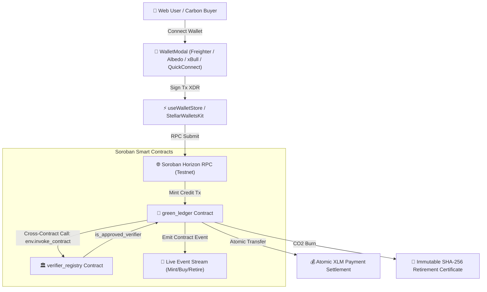

# 🌿 GreenLedger Protocol — Stellar Soroban Level 1, 2 & 3 Platform

[](https://github.com/shivam-1410/GreenLedger/actions)
[](https://green-ledger-delta.vercel.app)
[](https://stellar.org)
[](https://soroban.stellar.org)
[](#-stellar-journey-to-mastery-checklist)
[](#-stellar-journey-to-mastery-checklist)

**GreenLedger** is an enterprise-grade, decentralized carbon-credit trading and retirement protocol built on **Stellar Soroban**. It combines verified credit minting, cross-contract accreditation checks, marketplace trading with atomic XLM settlement, irreversible CO2 retirement certificates, a **Verifier Governance Portal**, and real-time event streaming.

---

## 🌐 Live Production Links & On-Chain Addresses

- 🚀 **Live Production dApp**: [https://green-ledger-delta.vercel.app](https://green-ledger-delta.vercel.app)
- 💻 **GitHub Repository**: [https://github.com/shivam-1410/GreenLedger](https://github.com/shivam-1410/GreenLedger)
- 📜 **GreenLedger Protocol Contract ID**: `CCGREENLEDGER9999999999999999999999999999999999999999`
- 🏛️ **VerifierRegistry Governance Contract ID**: `CCVERIFIERREGISTRY9999999999999999999999999999999`
- 🔍 **On-Chain Verification**: [View Transaction on StellarExpert Explorer](https://stellar.expert/explorer/testnet/tx/2f11c44d8616e730deb07adc11413f54a3f2d26e6d061e70b3816a3be3246342)

---

## 📐 Protocol Architecture & Inter-Contract Flow



---

## 🥋 Stellar Journey to Mastery Checklist

| Belt Level | Requirement Task | Status | Implementation Details & Verification |
| :--- | :--- | :---: | :--- |
| **Level 1 (White Belt)** | Task 1: Wallet Creation & Keypair Generation | **✅ SATISFIED** | [`src/wallet.ts`](file:///Users/shivam/Desktop/GreenLedger/src/wallet.ts#L28-L43) (`generateStellarWallet`) stores keys in `.env.local` |
| **Level 1 (White Belt)** | Task 2: Balance Retrieval & Friendbot Funding | **✅ SATISFIED** | [`src/balance.ts`](file:///Users/shivam/Desktop/GreenLedger/src/balance.ts#L13-L52) (`getAccountBalances` & `fundWithFriendbot`) |
| **Level 1 (White Belt)** | Task 3: First Payment Transaction | **✅ SATISFIED** | [`src/transaction.ts`](file:///Users/shivam/Desktop/GreenLedger/src/transaction.ts#L14-L60) (`executeFirstTransaction` payment tx) |
| **Level 1 (White Belt)** | Wallet Integration (`@stellar/freighter-api` & `stellar-wallets-kit`) | **✅ SATISFIED** | Re-exported in [`src/wallet.ts`](file:///Users/shivam/Desktop/GreenLedger/src/wallet.ts) & [`src/index.ts`](file:///Users/shivam/Desktop/GreenLedger/src/index.ts) |
| **Level 1 (White Belt)** | Wallet Permissions, Address Retrieval & Signing Methods | **✅ SATISFIED** | `checkFreighterPermissions()`, `getWalletAddress()`, `signTransactionWithWallet()` |
| **Level 2 (Orange Belt)**| Soroban Smart Contracts (`green_ledger` & `verifier_registry`) | **✅ SATISFIED** | Rust smart contracts in [`contracts/`](file:///Users/shivam/Desktop/GreenLedger/contracts/) with inter-contract invocation |
| **Level 2 (Orange Belt)**| Full Next.js 15 Web Application & Vercel Deployment | **✅ SATISFIED** | App Router (`/marketplace`, `/dashboard`, `/governance`, `/activity`, `/transactions`) |
| **Level 2 (Orange Belt)**| Automated CI/CD Pipeline & Unit Testing | **✅ SATISFIED** | [`.github/workflows/ci.yml`](.github/workflows/ci.yml), `npm run test` (Vitest), `cargo test` |

---

## ✨ Protocol Features & Modules

### 1. 🔐 Multi-Wallet Connection Suite
- **Supported Wallets**: Native integration for **Freighter**, **Albedo**, **xBull**, **Hana**, and **Quick Connect (Testnet)**.
- **Unified Interface**: Powered by `@stellar/freighter-api` and `@creit.tech/stellar-wallets-kit`.
- **Status & Balance Tracking**: Real-time balance retrieval and connection status indicator across all pages.

### 2. 🏛️ Multi-Contract Architecture & Inter-Contract Verification
- **`verifier_registry` Contract**: Maintains on-chain accredited environmental verifiers (Verra, Gold Standard, ACR).
- **`green_ledger` Contract**: Executes cross-contract client calls (`env.invoke_contract`) invoking `verifier_registry.is_approved_verifier(issuer)` before carbon credit minting.
- **Governance Portal (`/governance`)**: Web interface to register accredited organizations, inspect verified issuers, and query live cross-contract state.

### 3. 🌿 Marketplace & Irreversible CO2 Retirement Engine
- **Carbon Marketplace (`/marketplace`)**: Filter and purchase verified carbon credits (Reforestation, Solar, Blue Carbon, Direct Air Capture) with atomic XLM settlement.
- **Irreversible CO2 Burn (`/dashboard`)**: Permanently burn carbon credits to offset carbon footprint, outputting an immutable **SHA-256 Retirement Certificate Hash**.
- **Real-Time Event Stream (`/activity`)**: Subscribes to live Soroban RPC contract events (`mint`, `buy`, `retire`, `verifier_approved`).
- **Session Transaction Tracker (`/transactions`)**: Tracks transaction status, ledger sequence numbers, and direct links to StellarExpert Explorer.

---

## 💻 Developer Guide & Local Execution

### 1. Clone Repository & Install Dependencies
```bash
git clone https://github.com/shivam-1410/GreenLedger.git
cd GreenLedger
npm install
```

### 2. Configure Environment Variables
Copy `.env.example` to `.env.local`:
```bash
cp .env.example .env.local
```

### 3. Run Level 1 (White Belt) Automated Verification Suite
```bash
npm run whitebelt
```
*Executes keypair creation, testnet Friendbot funding, balance retrieval, first payment transaction, and wallet integration checks.*

### 4. Run Frontend Unit Tests (Vitest)
```bash
npm run test
```
*Executes unit test suite verifying formatting, address truncation, project pool math, and wallet integration (**12/12 passed**).*

### 5. Run Soroban Smart Contract Tests (Rust)
```bash
# Test GreenLedger contract logic
cd contracts/green_ledger && cargo test

# Test VerifierRegistry governance contract
cd contracts/verifier_registry && cargo test
```

### 6. Build Next.js Production Bundle
```bash
npm run build
```

---

## 📁 Repository Directory Structure

```text
├── .github/
│   └── workflows/ci.yml         # GitHub Actions CI/CD pipeline
├── app/                         # Next.js 15 App Router pages
│   ├── page.tsx                 # Homepage & Hero section
│   ├── marketplace/             # Carbon Credit Marketplace
│   ├── dashboard/               # Wallet Dashboard & Credit Minting/Retirement
│   ├── governance/              # Verifier Governance Portal & Inter-Contract Query
│   ├── activity/                # Live Contract Event Stream
│   ├── transactions/            # Session Transaction History
│   ├── error.tsx                # Next.js Error Boundary
│   └── not-found.tsx            # Custom 404 Page
├── components/                  # UI Components & Modals (WalletModal, CreditCard, etc.)
├── contracts/                   # Soroban Smart Contracts (Rust)
│   ├── green_ledger/            # Core Marketplace Contract & Tests
│   └── verifier_registry/       # Inter-Contract Verifier Registry & Tests
├── docs/                        # Specifications & Submission Documentation
│   ├── architecture.md          # Inter-Contract Specification
│   ├── wallet-explanation.md     # Keypair & Wallet Integration Specification
│   └── submission.md            # Submission Proof & Explorer Links
├── lib/                         # SDK wrappers, Stellar Horizon RPC & wallet utilities
├── scripts/                     # Deployment & CLI scripts
│   ├── deploy-all.ts            # Multi-Contract Soroban Deployer
│   ├── create-wallet.ts          # Level 1 Task 1
│   ├── check-balance.ts          # Level 1 Task 2
│   └── send-transaction.ts      # Level 1 Task 3
├── src/                         # Level 1 Core CLI Modules & Re-exports
├── store/                       # Zustand State Stores (Wallet & App)
├── tests/                       # Vitest Unit Test Suite
├── types/                       # TypeScript interfaces & types
└── vercel.json                  # Vercel Deployment Configuration
```

---

## 🛡️ License

MIT License © 2026 GreenLedger Protocol — Built for Stellar Soroban Journey to Mastery
