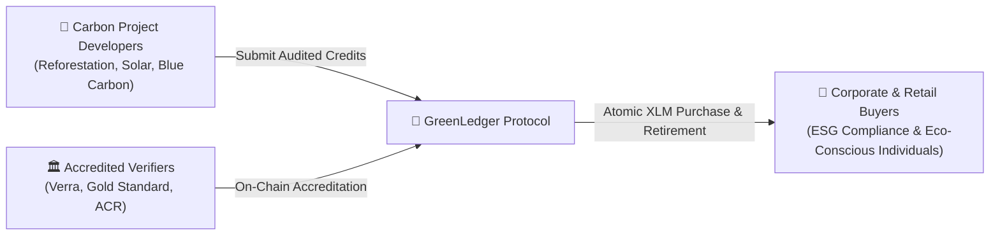
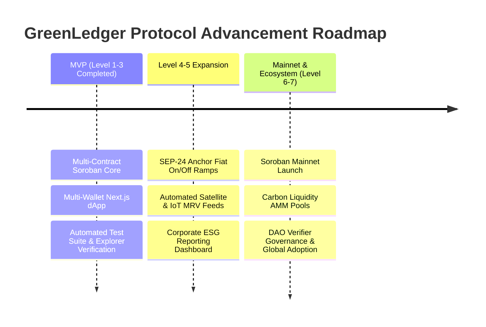

# 🌿 GreenLedger Protocol — Official Idea Submission & Architecture Proposal

**Project Name:** GreenLedger Protocol  
**Target Category:** Real-World Asset Tokenization, Micro-Payments, & Soroban DeFi Ecosystem  
**Target Advancement:** Approval to unlock **Level 4, Level 5, & Level 6**  
**Live Production dApp:** [https://green-ledger-delta.vercel.app](https://green-ledger-delta.vercel.app)  
**GitHub Repository:** [https://github.com/shivam-1410/GreenLedger](https://github.com/shivam-1410/GreenLedger)  
**Submission Date:** August 2026  

---

## 🌟 Executive Summary

Climate change is hands-down the defining challenge of our generation. Yet, if you look under the hood of today's $2 Billion Voluntary Carbon Market (VCM), you'll find a ecosystem broken by opacity, multi-day clearance times, absurd broker fees, and persistent "greenwashing". 

Small reforestation teams in emerging markets struggle to get funded, while corporations buying carbon offsets are left second-guessing whether their purchase actually helped the planet or just paid off a middleman.

We built **GreenLedger Protocol** to fix this from first principles on **Stellar Soroban**. 

GreenLedger is a decentralized carbon-credit trading and retirement platform that turns real-world environmental assets into verifiable, liquid digital tokens. By pairing on-chain verifier governance with cross-contract accreditation checks, atomic XLM settlement, and permanent CO2 retirement certificates that output cryptographic SHA-256 hashes, GreenLedger makes carbon offsetting transparent, instant, and accessible to anyone—from global enterprise ESG teams to individual everyday users.

---

## 1. 🎯 Problem Statement

When we researched the voluntary carbon market, four main friction points kept showing up:

1. **The Greenwashing Epidemic**: Without tamper-proof on-chain verification, dubious carbon projects can issue unverified offset tokens without legitimate third-party audits, destroying buyer confidence.
2. **Double-Counting & The Resale Trap**: Because traditional registries lack a single, immutable source of truth, carbon credits are frequently bought, resold, and claimed multiple times across opaque over-the-counter (OTC) desks.
3. **High Broker Cut & Slow Settlement**: Legacy carbon brokers swallow up to 15–20% in transaction fees, taking up to 5 days to clear payments. That money belongs in local ecosystems, not in middleman pockets.
4. **Community Conservation Cutoff**: Small-scale conservation projects (like a community planting mangroves in Southeast Asia) can't afford the exorbitant listing fees required by centralized carbon registries, locking them out of global climate capital.

---

## 2. ⚡ Why Stellar?

When deciding where to build GreenLedger, we asked ourselves a fundamental question: *How can you build a climate solution on a blockchain if the ledger itself burns massive amounts of electricity?*

Stellar was the obvious choice for us:

### A. True Net-Zero Ledger Consensus (SCP)
Stellar’s Consensus Protocol (SCP) relies on federated consensus rather than energy-heavy Proof-of-Work. It delivers rapid transaction confirmation with negligible energy consumption. Building an environmental accounting ledger on Stellar ensures our infrastructure is genuinely green.

### B. Sub-Second Finality & Micro-Payment Economics
Carbon offset retirements shouldn't be reserved for multi-million dollar conglomerates. Stellar offers ~3–5 second finality with near-zero transaction fees ($0.00001 per tx). This makes **micro-offset payments** possible—enabling users to offset the exact carbon footprint of a single rideshare trip, delivery package, or flight ticket.

### C. Soroban Smart Contracts (Rust WASM)
Soroban gives us the expressiveness of Rust with WebAssembly safety. Its state optimization and native cross-contract calls (`env.invoke_contract`) let us enforce mandatory verifier checks on-chain before a credit can ever be minted.

### D. Global Fiat On/Off Ramps (SEP-24)
Stellar’s established Anchor network (SEP-24 / SEP-31) means everyday corporate buyers and retail users can purchase carbon credits directly using local fiat currencies (USD, EUR, BRL) without jumping through complex crypto hoops.

---

## 3. 👥 Target Users

GreenLedger connects three core groups into one transparent ecosystem:



1. **Carbon Project Developers (Issuers)**: Reforestation crews, solar farm builders, and ocean blue-carbon initiatives seeking immediate global liquidity and direct capital deployment without middleman cuts.
2. **Accredited Environmental Verifiers (Governors)**: Trusted auditing standards (Verra, Gold Standard, American Carbon Registry) who register on-chain to verify project issuers and prevent greenwashing.
3. **Corporate & Retail Carbon Buyers (Consumers)**: Enterprises requiring audit-ready ESG compliance documentation, alongside eco-conscious individuals looking to calculate and burn their carbon footprint with cryptographic proof.

---

## 4. 📐 Technical Architecture & Data Flow

We designed GreenLedger with a modular, dual-contract architecture on Soroban, paired with a Next.js 15 App Router web interface and real-time event indexing.

### A. Component Layering

```mermaid
flowchart TD
    User["👤 Web Client / Carbon Buyer"] -->|Connect Wallet| UI["🖥️ Next.js 15 App Router + Tailwind CSS"]
    UI -->|Zustand & StellarWalletsKit| WalletStore["⚡ Wallet Store (Freighter / Albedo / xBull)"]
    WalletStore -->|Signed Soroban RPC Tx| SorobanRPC["🌐 Stellar Horizon RPC / Soroban Node"]

    subgraph Soroban Smart Contracts (Rust WASM)
        SorobanRPC -->|Mint Credit Tx| CoreContract["🌿 green_ledger Contract"]
        CoreContract -->|Cross-Contract Call: env.invoke_contract| RegistryContract["🏛️ verifier_registry Contract"]
        RegistryContract -->|is_approved_verifier(issuer)| CoreContract
        CoreContract -->|Emit Contract Events| EventStream["📡 Live Event Stream (Mint / Buy / Retire)"]
    end

    CoreContract -->|Atomic Settlement| XLMPayment["💰 XLM Native Settlement"]
    CoreContract -->|Permanent CO2 Burn| CertGen["📜 SHA-256 Immutable Retirement Certificate"]
```

### B. Soroban Smart Contracts
1. **`verifier_registry` Contract**:
   * Stores public key addresses and metadata of accredited environmental verifiers.
   * Exposes governance helper `is_approved_verifier(issuer: Address) -> bool`.
2. **`green_ledger` Contract**:
   * Handles credit minting, marketplace listings, atomic purchases, and permanent token retirements.
   * **Inter-Contract Verification**: Dynamically invokes `verifier_registry.is_approved_verifier()` before authorizing any mint operation.
   * Emits contract events (`mint`, `buy`, `retire`, `verifier_approved`) for real-time frontend indexing.

---

## 5. 🧠 Complexity & Technical Challenges

Building GreenLedger required tackling several tough engineering challenges on Soroban:

* **Safe Cross-Contract Invocations**: Orchestrating inter-contract state checks between `green_ledger` and `verifier_registry` in Rust WASM without inflating gas consumption or storage footprint.
* **Atomic Multi-Asset Settlement**: Ensuring that carbon token transfers and native XLM payments happen atomically in a single transaction, eliminating front-running and partial fill bugs.
* **Permanent Burning & SHA-256 Certificate Generation**: Creating a tamper-proof retirement mechanism that burns token supply and outputs an immutable SHA-256 hash certificate for corporate ESG reporting.
* **Unified Multi-Wallet DX**: Crafting a seamless frontend experience powered by `@stellar/freighter-api` and `@creit.tech/stellar-wallets-kit` that handles session persistence, real-time balance polling, and live event streams across Freighter, Albedo, and xBull.

---

## 6. 🗺️ Strategic Roadmap & Ecosystem Vision



### Phase 1: MVP & Protocol Foundation *(Completed — Levels 1, 2 & 3)*
* ✅ Deployed WASM smart contracts (`green_ledger` & `verifier_registry`) on Stellar Testnet.
* ✅ Passed comprehensive frontend and contract unit test suites (Vitest + Rust cargo tests).
* ✅ Built and deployed production Next.js 15 Web Application on Vercel ([https://green-ledger-delta.vercel.app](https://green-ledger-delta.vercel.app)).
* ✅ Enabled multi-wallet onboarding and live event activity feeds.

### Phase 2: User Onboarding & Fiat Ramps *(Level 4 & 5 Vision)*
* 🔄 **SEP-24 / Anchor Integration**: Teaming up with Stellar Anchors to support direct fiat credit card and local bank purchases.
* 🔄 **IoT & Satellite MRV Feeds**: Connecting satellite imagery APIs (Sentinel/Landsat) to automatically measure forest canopy growth and verify carbon sequestration in real-time.
* 🔄 **Corporate ESG API**: Building a developer API allowing enterprise ERP systems (SAP, Salesforce) to auto-retire carbon offsets upon shipping events.

### Phase 3: Mainnet & Global Ecosystem *(Level 6 & 7 Vision)*
* 🚀 **Soroban Mainnet Launch**: Auditing and deploying core contracts onto Stellar Mainnet.
* 🚀 **Carbon Credit Liquidity Pools (Soroban AMM)**: Creating automated market maker pools pairing Carbon Tokens with XLM and USDC for continuous price discovery.
* 🚀 **Decentralized Verifier DAO**: Transitioning registry administration to a multi-signature DAO governed by leading international environmental standards.

---

## 🙋 Conclusion

We built GreenLedger Protocol because we believe climate finance desperately needs open, transparent, and instant digital primitives. Stellar's speed, low cost, and powerful Soroban smart contracts make it the ideal foundation for this mission. 

We respectfully submit this proposal to the **Stellar Builder Team** for review and look forward to unlocking **Level 4, Level 5, and Level 6** advancement!
