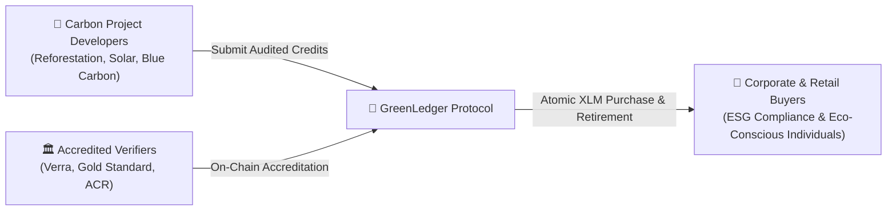
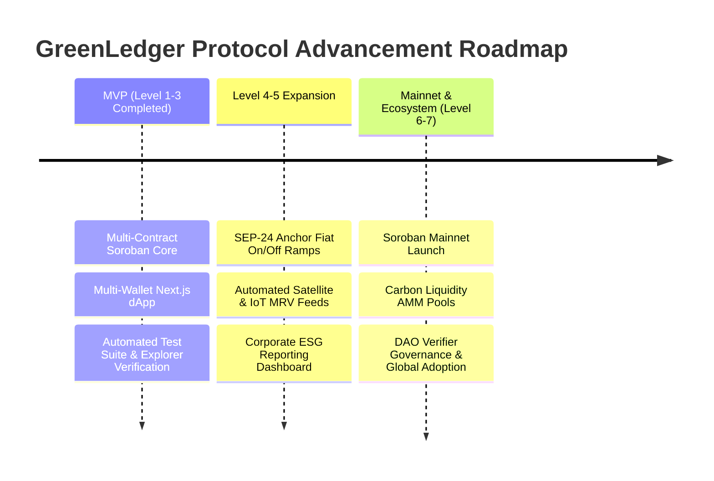

# 🌿 GreenLedger Protocol — Official Idea Submission & Architecture Proposal

**Project Name:** GreenLedger Protocol  
**Target Category:** Asset Tokenization, Payments, & DeFi Ecosystem  
**Target Stellar Levels:** Unlocking Level 4, Level 5, & Level 6 Advancement  
**Submission Date:** August 2026  

---

## 🌟 Executive Summary

Climate change is the defining challenge of our era, yet voluntary carbon markets (VCM) remain fragmented, opaque, and plagued by "greenwashing" and double-counting. Traditional carbon offset trading relies on centralized registries, manual audits, and multi-day settlement cycles that lock out retail participation and micro-projects.

**GreenLedger Protocol** solves this by establishing a decentralized, enterprise-grade carbon credit marketplace and retirement engine natively built on **Stellar Soroban**. By combining verified asset tokenization, an on-chain verifier governance registry, cross-contract accreditation checks, atomic XLM settlement, and irreversible CO2 retirement certificates emitting cryptographic SHA-256 hashes, GreenLedger brings trust, liquidity, and global access to the climate economy.

---

## 1. 🎯 Problem Statement

The $2 Billion Voluntary Carbon Market faces structural inefficiencies that limit scale and credibility:

1. **Greenwashing & Unaccredited Credits**: Fraudulent or unverified projects issue dubious carbon offsets without verifiable third-party auditing, eroding buyer confidence.
2. **Double-Counting & Lack of Proof**: Carbon credits are frequently resold multiple times across opaque OTC (over-the-counter) desks due to missing immutable retirement records.
3. **High Transaction Fees & Slow Settlement**: Legacy carbon registries require manual wire transfers, broker fees (up to 15-20%), and 3-5 day clearance times.
4. **Liquidity Fragmentation**: Small-scale conservation projects (e.g., community reforestations in emerging economies) struggle to access global liquidity or tokenize their carbon offsets.

---

## 2. ⚡ Why Stellar?

Stellar is uniquely positioned as the optimal blockchain for real-world environmental asset tokenization and payments for several key reasons:

### A. Low Energy & Eco-Friendly Consensus (SCP)
Unlike Proof-of-Work networks, the **Stellar Consensus Protocol (SCP)** is lightweight, fast, and highly energy-efficient. Building a climate-focused protocol on a high-carbon-footprint blockchain creates a hypocritical paradox; Stellar provides true net-zero ledger infrastructure.

### B. Sub-Second Finality & Near-Zero Fees
Carbon credit retirements and micro-transactions require high throughput and minimal cost. Stellar delivers ~3-5 second deterministic finality with fees of fractions of a cent ($0.00001 per transaction), enabling micro-offset purchases (e.g., offsetting a single rideshare trip or coffee shipment).

### C. Soroban Smart Contract Architecture
Soroban brings Rust-based WebAssembly (WASM) smart contracts to Stellar. Its state footprint optimization and secure cross-contract invocation (`env.invoke_contract`) allow GreenLedger to enforce mandatory verifier checks on-chain before any token minting occurs.

### D. Native Asset Tokenization & On/Off Ramps (SEP-24)
Stellar’s native anchor ecosystem (SEP-24 / SEP-31) and fiat on-ramps enable seamless conversion between global fiat currencies (USD, EUR, BRL) and digital XLM/stablecoins. Buyers worldwide can purchase and retire carbon credits without needing complex crypto onboarding steps.

---

## 3. 👥 Target Users

GreenLedger serves three distinct user segments across the global carbon lifecycle:



1. **Carbon Project Developers (Issuers)**: Reforestation groups, renewable energy developers, direct-air-capture ventures, and blue-carbon ocean projects seeking global liquidity and immediate capital deployment.
2. **Accredited Environmental Verifiers (Governors)**: Recognized auditing bodies (Verra, Gold Standard, American Carbon Registry) who register on-chain to approve legitimate project issuers and prevent greenwashing.
3. **Corporate & Retail Carbon Buyers (Consumers)**: Enterprises needing verifiable ESG compliance reporting, as well as eco-conscious individuals looking to calculate and burn their carbon footprint with cryptographic proof.

---

## 4. 📐 Technical Architecture & System Data Flow

GreenLedger utilizes a multi-contract architecture on Soroban paired with an enterprise Next.js 15 Web interface and real-time event indexing.

### A. Component Layering

```mermaid
flowchart TD
    User["👤 Web Client / Carbon Buyer"] -->|Connect Wallet| UI["🖥️ Next.js 15 App Router + Tailwind CSS"]
    UI -->|Zustand & StellarWalletsKit| WalletStore["⚡ Wallet Store (Freighter / Albedo / xBull)"]
    WalletStore -->|Signed Soroban RPC Tx| SorobanRPC["🌐 Stellar Horizon RPC / Soroban Node"]

    subgraph Soroban Smart Contracts (Rust WASM)
        SorobanRPC -->|Mint Credit Tx| CoreContract["🌿 green_ledger Contract"]
        CoreContract -->|Cross-Contract Call: env.invoke_contract| RegistryContract["🏛️ verifier_registry Contract"]
        RegistryContract -->|is_approved_verifier(issuer)| CoreContract
        CoreContract -->|Emit Contract Events| EventStream["📡 Live Event Stream (Mint / Buy / Retire)"]
    end

    CoreContract -->|Atomic Settlement| XLMPayment["💰 XLM Native Settlement"]
    CoreContract -->|Permanent CO2 Burn| CertGen["📜 SHA-256 Immutable Retirement Certificate"]
```

### B. Contract Architecture
1. **`verifier_registry` Contract**:
   * Stores accredited verifier public keys and metadata.
   * Exposes governance functions to add/revoke approved environmental auditors.
2. **`green_ledger` Contract**:
   * Manages carbon credit token minting, marketplace listings, buy orders, and retirement logic.
   * Performs an **inter-contract cross-invocation** to `verifier_registry.is_approved_verifier()` before authorizing any credit minting operation.
   * Emits Soroban events (`mint`, `buy`, `retire`) for real-time frontend indexing.

---

## 5. 🧠 Complexity & Technical Challenges

Building GreenLedger required solving several non-trivial engineering problems on Soroban:

1. **Inter-Contract Authorization & Invocation**: Orchestrating cross-contract state queries between `green_ledger` and `verifier_registry` in Rust WASM without incurring unnecessary storage footprint or gas overhead.
2. **Atomic Multi-Asset Settlement**: Ensuring carbon credit ownership transfer and native XLM payment execute atomically, preventing partial failures or front-running in the marketplace.
3. **Irreversible Retirement & Certificate Generation**: Designing a tamper-proof carbon burning mechanism that permanently locks credit supply while dynamically generating a cryptographic SHA-256 hash certificate for corporate ESG auditing.
4. **Unified Multi-Wallet Compatibility**: Engineering a seamless frontend integration supporting Freighter, Albedo, xBull, and QuickConnect with automatic balance recovery and network state synchronization.

---

## 6. 🗺️ Strategic Roadmap



### Phase 1: MVP & Core Protocol (Completed — Levels 1, 2 & 3)
* ✅ Rust WASM smart contracts deployed on Stellar Testnet (`green_ledger` & `verifier_registry`).
* ✅ Cross-contract verification logic & unit test suites (Vitest + Cargo tests).
* ✅ Production Next.js 15 Web Application deployed on Vercel ([https://green-ledger-delta.vercel.app](https://green-ledger-delta.vercel.app)).
* ✅ Multi-wallet support (Freighter, Albedo, xBull) and live event stream.

### Phase 2: User Onboarding & Fiat Ramps (Level 4 & 5 Vision)
* 🔄 **SEP-24 / Anchor Integration**: Partnering with Stellar anchors to enable direct credit purchases via credit card and local fiat currencies (USD, BRL, EUR).
* 🔄 **IoT & Satellite MRV (Measurement, Reporting, Verification)**: Integrating real-time satellite imagery feeds to automatically verify tree growth and carbon sequestration for forest projects.
* 🔄 **Corporate ESG Portal**: Standardized API endpoints allowing enterprise ERP systems (SAP, Salesforce) to auto-retire carbon offsets upon shipping/logistics events.

### Phase 3: Mainnet Launch & Ecosystem Scaling (Level 6 & 7 Vision)
* 🚀 **Soroban Mainnet Deployment**: Migrating core contracts to Stellar Mainnet with audited security parameters.
* 🚀 **Carbon Credit Liquidity Pools (Soroban AMM)**: Creating automated market maker pools pairing Carbon Tokens with XLM and USDC for continuous price discovery.
* 🚀 **Decentralized Verifier DAO**: Transitioning verifier registry governance to a multi-signature DAO of global environmental standards organizations.

---

## 🙋 Conclusion

GreenLedger Protocol is not just another tokenization demo—it is a purpose-built financial primitives platform for the net-zero carbon economy, designed specifically to leverage Stellar's speed, low cost, and Soroban smart contract capabilities. We respectfully submit this proposal to the **Stellar Builder Team** for evaluation and approval to unlock **Level 4, 5, & 6 advancement**.
