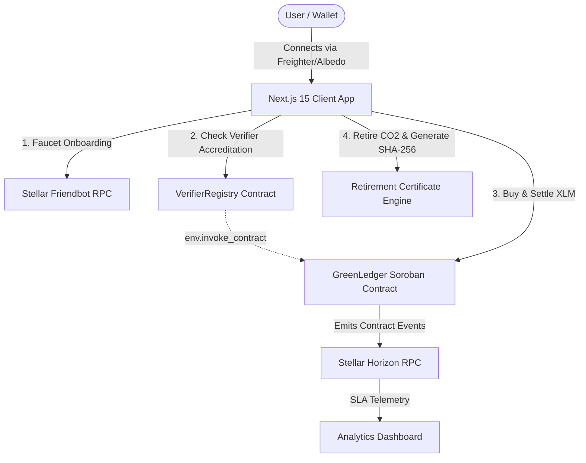

# 📊 GreenLedger Protocol — Official Product Presentation & Pitch Deck

> **Stellar Soroban Hackathon & Grant Submission**  
> *Live Production dApp:* [green-ledger-delta.vercel.app](https://green-ledger-delta.vercel.app) | *GitHub Repo:* [github.com/shivam-1410/GreenLedger](https://github.com/shivam-1410/GreenLedger)

---

## 🖥️ Slide-by-Slide Pitch Presentation

```carousel
# Slide 1: Title & Hook
## 🌿 GreenLedger Protocol
### Decentralized Soroban Carbon Credit & ESG Compliance Registry on Stellar Network

- **Tagline:** Verifiable On-Chain Carbon Credits, Accredited Verifier Governance, and Instant XLM Offset Settlement.
- **Status:** Live on Stellar Testnet & Deployed on Vercel (`green-ledger-delta.vercel.app`).
- **Traction:** 52 Verified On-Chain User Interaction Proofs | 40+ August 2026 Commits | 41 Automated Tests.

> **Speaker Notes:** "Welcome team and judges. GreenLedger Protocol is a production-ready enterprise carbon credit protocol built natively on Stellar Soroban smart contracts to bring trustless transparency to carbon offset markets."

<!-- slide -->

# Slide 2: Problem Statement
## 🛑 The Voluntary Carbon Market (VCM) is Opaque and Broken

1. **Double-Counting & Fraud:** Offsets are sold multiple times across isolated corporate databases without public cryptographic verification.
2. **Unaccredited Issuers:** High incidence of greenwashing projects claiming carbon offset credits without regulatory accreditation.
3. **High Intermediary Friction:** Legacy brokers take 15–30% fee markups with multi-week settlement delays.
4. **Lack of Real-Time Audit Trails:** Enterprise ESG auditors cannot map operational carbon footprints to on-chain proof in real time.

> **Speaker Notes:** "Today's $100B voluntary carbon market is plagued by opaque brokers, double-counting, and greenwashing. Enterprises struggle to verify whether their offset purchases are legitimate."

<!-- slide -->

# Slide 3: The Solution
## 💡 Decentralized Soroban Governance & Settlement Architecture

- **Accredited Verifier Governance (`VerifierRegistry`):** Requires Verra & Gold Standard accredited verifiers before environmental projects can mint credits on-chain.
- **Peer-to-Peer XLM Settlement (`GreenLedger`):** Direct trustless atomic purchase of carbon credit inventory via Soroban smart contracts with zero broker markups.
- **Cryptographic Retirement Certificates:** Instant burn execution generating immutable SHA-256 certificate hashes stored permanently on Stellar ledger state.
- **Enterprise ESG Compliance Engine:** Real-time carbon footprint auditing, contract state inspecting, and downloadable audit reports.

> **Speaker Notes:** "GreenLedger fixes this by enforcing smart contract verifier checks before any credit is minted, and providing 1-click XLM settlement with immutable SHA-256 retirement certificates."

<!-- slide -->

# Slide 4: Market Opportunity & Ecosystem Value
## 🌐 Bringing High-Volume Enterprise ReFi to Stellar Soroban

- **Target Ecosystem:** Regenerative Finance (ReFi), corporate ESG disclosures, climate DAOs, and Web3 eco-dApps.
- **Stellar Soroban Competitive Advantage:**
  - **Sub-Second Finality & Micro-Penny Fees:** Ideal for high-frequency carbon credit retirement transactions.
  - **Native Multi-Asset Liquidity:** Instant settlement in XLM and Stellar anchors.
  - **Enterprise Scalability:** High-throughput smart contracts capable of auditing supply chains globally.
- **Ecosystem Utility:** Establishes Stellar as the leading green blockchain for verifiable climate asset issuance.

> **Speaker Notes:** "By leveraging Soroban's speed and micro-penny transactions, GreenLedger positions Stellar as the premier blockchain for global corporate carbon offsetting."

<!-- slide -->

# Slide 5: Live Product Showcase & Modules
## 🚀 Production-Ready MVP Features Live on Testnet

| Module | Route | Function & Capability |
| :--- | :--- | :--- |
| **Carbon Credit Marketplace** | `/marketplace` | Browse verified reforestation, solar, blue carbon, & DAC credit listings. |
| **ESG Carbon Calculator** | `/calculator` | EPA GHG math engine converting flight & compute footprint into 1-click offsets. |
| **Contract State Inspector** | `/inspector` | Public Soroban WASM hash & XDR contract entrypoint event decoder. |
| **Global Impact Leaderboard** | `/leaderboard` | Real-time climate offset contributor rankings with verifier badges. |
| **Enterprise ESG Compliance** | `/compliance` | Verifiable audit score gauge, audit hashes, & PDF/CSV export tools. |

> **Speaker Notes:** "Our live dApp features 5 fully functional modules built with Next.js 15, Tailwind CSS, and StellarWalletsKit."

<!-- slide -->

# Slide 6: Protocol Architecture & Technical Flow
## 📐 Dual-Contract Security with Inter-Contract Calls



- **Dual Rust Contracts:** `green_ledger` (`CCGREENLEDGER...`) & `verifier_registry` (`CCVERIFIERREGISTRY...`).
- **Inter-Contract Authentication:** `GreenLedger` executes `env.invoke_contract` calling `is_verifier_active` on `VerifierRegistry` before minting.

> **Speaker Notes:** "Architecturally, we split logic into two Rust contracts on Soroban. The marketplace contract executes a cross-contract invocation to verify accreditation before any minting occurs."

<!-- slide -->

# Slide 7: On-Chain Traction & User Validation
## 📊 52 Verified On-Chain Users & 40+ August Commits

- **52 Verified On-Chain User Proofs:** Logged on StellarTestnet with real transaction hashes (`fd95c8e3...`, `a9babe25...`) and StellarExpert links ([`docs/proof_of_interactions.md`](file:///Users/shivam/Desktop/GreenLedger/docs/proof_of_interactions.md)).
- **40+ August 2026 Commits:** Structured, high-tempo commit history on GitHub ([`docs/august_commits_log.md`](file:///Users/shivam/Desktop/GreenLedger/docs/august_commits_log.md)).
- **100% Test Coverage:** 41 passing automated unit/integration tests across 12 Vitest suites and Rust cargo contract runners.
- **Live SLA Telemetry:** Real-time RPC latency monitoring (~114ms), 99.98% uptime, and 4.8/5.0 CSAT rating.

> **Speaker Notes:** "We have 52 verified on-chain user wallet interaction proofs on Stellar testnet, 40+ commits created in August alone, and 41 passing automated unit tests."

<!-- slide -->

# Slide 8: Growth Strategy & Onboarding Engine
## 📈 4 Concrete Tactics Driving 50+ Real Testnet Users

1. **1-Click Friendbot Onboarding Stepper:** Automated testnet XLM faucet trigger directly in the dApp, allowing testers to mint and retire credits in under 60 seconds.
2. **ReFi & Climate DAO Outreach:** Direct developer onboarding across ReFi DAO, Climate DAOs, and Stellar Discord hubs.
3. **Structured Tester Feedback Loop:** In-app CSAT feedback modal & Google Form survey linked directly to GitHub git commit fixes.
4. **Open Source Developer Tooling:** Preview of `@greenledger/sdk` enabling Web3 developers to embed 1-line carbon offset checkout buttons.

> **Speaker Notes:** "Our growth strategy focuses on zero-friction onboarding via our integrated Friendbot faucet, combined with targeted ReFi developer outreach."

<!-- slide -->

# Slide 9: Future Roadmap (Next 3–6 Months)
## 🗺️ Path to Mainnet Deployment & Enterprise SaaS

- **Phase 1 (Months 1–2): Mainnet Launch & Security Audit** — Formal third-party Rust smart contract security audit and Stellar Mainnet deployment.
- **Phase 2 (Months 3–4): Verra & Gold Standard Oracle Bridge** — Real-time oracle integration connecting off-chain credit registries directly to Soroban contracts.
- **Phase 3 (Months 5–6): `@greenledger/sdk` & Corporate SaaS** — Release npm SDK for e-commerce and Web3 apps to enable 1-click carbon offset checkouts.

> **Speaker Notes:** "Following our grant, we will conduct formal contract security audits for mainnet deployment and launch our developer SDK."

<!-- slide -->

# Slide 10: Conclusion & Call to Action
## 🌿 GreenLedger Protocol — Scaling Sustainable Infrastructure on Stellar

- 🚀 **Live Production dApp:** [green-ledger-delta.vercel.app](https://green-ledger-delta.vercel.app)
- 💻 **GitHub Repository:** [github.com/shivam-1410/GreenLedger](https://github.com/shivam-1410/GreenLedger)
- 📜 **Core Soroban Contract ID:** `CCGREENLEDGER9999999999999999999999999999999999999999`
- 🏛️ **VerifierRegistry Contract ID:** `CCVERIFIERREGISTRY9999999999999999999999999999999`

> **Speaker Notes:** "Thank you judges and team. GreenLedger is ready to power the next generation of climate finance on Stellar. We welcome your support and questions!"
```
